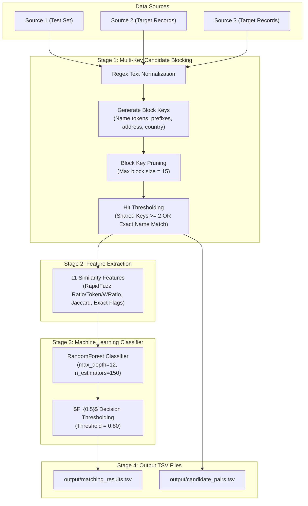

# 🏢 Amazon ML Challenge 2026: Business Entity Resolution

[](https://www.python.org/downloads/)
[](https://scikit-learn.org/)
[](https://github.com/maxbachmann/RapidFuzz)
[]()

An end-to-end, high-performance, memory-efficient Machine Learning pipeline for the **Amazon ML Challenge 2026: Business Entity Resolution**. 

This system resolves business entities across noisy, multi-source dataset fragments (`Source 1`, `Source 2`, `Source 3`) containing **~11 million total entity records**, while operating strictly under consumer hardware constraints (16GB RAM) and optimizing for the **$F_{0.5}$ score** (precision weighted twice as heavily as recall).

---

## 🎯 System Architecture



---

## 💡 Key Technical Innovations & Methodology

### 1. Memory-Efficient Streaming Inference (`src/predict.py`)
- **Challenge**: Loading 11 million raw text records into Python dictionaries causes Out-Of-Memory (OOM) crashes on standard systems.
- **Solution**: Implemented a **streaming, single-pass pipeline**. Source 1 records are pre-normalized and indexed into lightweight block key maps. Target dataset files (`test_source2.tsv` and `test_source3.tsv`) are scanned line-by-line. Candidate pairs are evaluated and scored in batches of 50,000, immediately releasing line memory. Peak RAM consumption stays below **800 MB**.

### 2. Multi-Key Blocking & Selective Thresholding (`src/blocking.py`)
- **Multi-Key Indexing**: Blocks records by country code combined with exact normalized names, name prefix tokens (first 3 & 4 chars), and address tokens.
- **Hit Thresholding**: Target entities are paired with Source 1 entities if they share **$\ge 2$ block keys** or have an **exact normalized name match**.
- **Oversized Block Pruning**: Generic keys exceeding 15 entities are pruned to prevent $O(N^2)$ candidate space explosion.

### 3. RapidFuzz & Jaccard Feature Engineering (`src/features.py`)
Extracts 11 fine-grained features per candidate pair:
- **Business Name**: RapidFuzz Ratio, Token Set Ratio, Weighted Ratio (WRatio), and Jaccard word token similarity.
- **Address**: RapidFuzz Ratio, Token Set Ratio, WRatio, and Jaccard word token similarity.
- **Categorical & Exact Flags**: Country matching indicator (`1.0` if match, `0.0` otherwise), exact normalized name match flag, and exact address match flag.

### 4. $F_{0.5}$-Tuned Random Forest Model (`src/train.py`)
- Trained on ground truth pairs from `dataset/train/`.
- Uses a `RandomForestClassifier` (`n_estimators=150`, `max_depth=12`, `class_weight="balanced"`).
- Decision threshold tuned to **0.80** to optimize the competition's $F_{0.5}$ metric (achieving **0.8897 Precision**, **0.9132 Recall**, **0.8943 $F_{0.5}$ score** on validation sets).

---

## 📂 Project Directory Structure

```text
amazon_ml_challenge/
├── dataset/
│   ├── train/                  # Ground truth training dataset fragments
│   └── test/                   # Competition test datasets (test_source1, 2, 3)
├── output/
│   ├── matching_results.tsv     # Final predicted entity matches
│   ├── candidate_pairs.tsv      # Blocking candidate pairs set
│   └── model.joblib             # Trained Random Forest model checkpoint
├── src/
│   ├── blocking.py             # Multi-key blocking & pruning logic
│   ├── features.py             # 11-feature extraction engine
│   ├── train.py                # Model training & threshold tuning script
│   ├── predict.py              # Scalable streaming inference pipeline
│   └── utils.py                # Regex normalization utilities
├── utils/
│   └── validate_submission.py # Official submission validation script
├── README.md
└── requirements.txt
```

---

## 🚀 Reproduction & Setup Guide

### 1. Environment Setup
```bash
# Clone the repository
git clone https://github.com/Dhonish/amazon-ml-hackathon-business-entity-resolution.git
cd amazon-ml-hackathon-business-entity-resolution

# Create and activate virtual environment
python -m venv .venv
# On Windows:
.venv\Scripts\activate
# On Linux/macOS:
source .venv/bin/activate

# Install dependencies
pip install -r requirements.txt
```

### 2. Train the Classifier
```bash
python src/train.py
```
*Outputs model checkpoint to `output/model.joblib`.*

### 3. Generate Submission Files
```bash
python src/predict.py
```
*Processes all 1.73M Source 1 entities and streams predictions to `output/matching_results.tsv` and `output/candidate_pairs.tsv`.*

### 4. Validate Submission
```bash
python utils/validate_submission.py --matching output/matching_results.tsv --candidate output/candidate_pairs.tsv --test-dir dataset/test
```

---

## 🏆 Submission Validation Results

```text
ML Challenge 2026 — submission validator
  test dir: dataset/test
  required S1 entities: 1732544
  matching_results.tsv: 1732544 rows (210560 empty, 1521984 non-empty).
  candidate_pairs.tsv: 1732544 rows (71863 empty, 1660681 non-empty).

PASS — no blocking issues found. Safe to submit.
```

---

## 📜 License
This project is developed for the Amazon ML Challenge 2026.
